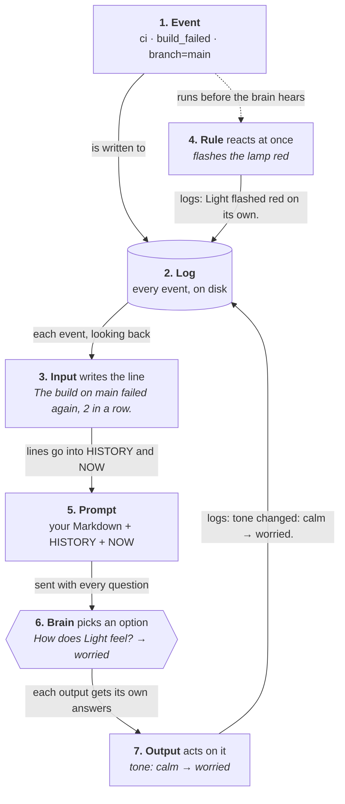

# How MellowHarness works

Updated 2026-10-07. [README.md](README.md) is the short version. This is
the tour: how an event becomes a line, the lines a prompt, and the
brain's answers something your app does. The code and its tests have
every rule.

Here's the whole path, following one event: a desk lamp, Light, hears
that the build on `main` has failed for the second time in a row.



Each numbered section below is one box. Then
[Putting it together](#putting-it-together-a-lamp-that-worries) builds
Light in one page of Swift.

## 1. Events

An event is something that happened. It's one JSON line, the same on
disk and on the socket:

```json
{
  "seq": 1,
  "at": 1791351801523,
  "source": "ci",
  "kind": "build_failed",
  "data": {"branch": "main", "run": 812}
}
```

| Field | What it is |
| --- | --- |
| `seq` | Its number in the log, stamped by the log. It counts on across days and launches |
| `at` | When, in unix milliseconds, stamped by the log unless the sender set it |
| `source` | Who it's from: `ci`, `device`, `self`. Any string |
| `kind` | What it is: `build_failed`, `press`. Any string |
| `line` | Its own line of English, for a kind with no input to write one. Optional |
| `data` | Everything else, with its keys sorted |

There are no fields for priority, sessions or anything else. An app
that needs them puts them in `data`.

### Three ways in

All three end in the same `emit`:

| Way | For |
| --- | --- |
| `h.emit(...)` | Your own code |
| `EventServer` | Other processes: a Unix socket that takes one JSON event per line |
| `mellowharness-emit` | A shell or a CI script: `mellowharness-emit --socket /tmp/light.sock ci build_failed branch=main` |

### The harness's own events

The harness logs what it does as events too, from `source` `self`. Each
has a `for`, the `seq` of the event it answers:

| `kind` | When |
| --- | --- |
| `did` | A rule or an output did something. Its `message` is the sentence HISTORY shows |
| `ended` | Something that took a while (an animation, a sound) finished, or never will |
| `pass` | Every call to the brain, with its answers. Held and dropped calls too, with why |

Here's the brain's answer to the event above:

```json
{
  "seq": 3,
  "at": 1791351801526,
  "source": "self",
  "kind": "pass",
  "data": {
    "for": 1,
    "brain": "scripted",
    "answers": {"tone": {"choice": "worried", "p": {"worried": 1}}},
    "dropped": null,
    "ms": 0
  }
}
```

## 2. The log

**The log is the only state.** Lines, questions, a mood's current value,
and which event the brain answers next are all worked out from it. The
only thing held in memory besides the log is which call to the brain is
running.

- **On disk**, it's one file a day, `<folder>/<yyyy-mm-dd>.jsonl`, kept
  for 14 days.
- **In memory**, it keeps the last 24 hours.
- **At launch**, `h.resume()` reads the files back, so the app picks up
  where it left off with nothing else to restore.
- **The same log always gives the same prompt.** Replaying it gives the
  same lines, which makes the whole thing testable.

Every function you register gets a `LogView`, a read-only view of the
log with look-backs like `last`, `count` and `recent(within:)`.

## 3. Inputs: lines and waking

An input turns one kind of event into a line of English, by looking
back at the log. With a `wake`, that kind wakes the brain:

```swift
h.input("build_failed", wake: 1) { e, log in
    let branch = e["branch"]?.string ?? "main"
    let streak = log.count("build_failed", since: log.last("build_passed"))
    return streak == 0 ? "The build on \(branch) failed."
                       : "The build on \(branch) failed again, \(streak + 1) in a row."
}
```

- **The line** can be a string, a line with notes indented under it, or
  `nil` to hide the event: no line, and it never wakes the brain.
- **A kind you never registered** has no line, but it's still logged,
  and every look-back can read it.
- **`wake`** is a priority. Left out, the kind never wakes the brain. A
  higher number goes ahead of lower ones waiting, and `0` gives way to
  any newer event that wakes it.
- **`h.hold(kind)`** is an optional check, asked when an event's turn
  comes: a reason to hold it back ("the button is being mashed"), or
  nil.

Simple kinds can come from a JSON file instead, with `h.load(url)`:

```json
{
  "build_passed": {"line": "The build on {branch} passed.", "wake": 1},
  "deploy": {"line": "{who} deployed {service}."}
}
```

## 4. Rules

A rule is your own code. It runs at once on an event, before the brain
hears about it, and never waits for the brain:

```swift
h.on("build_failed") { e in
    lamp.flash(.red)  // your own code
    h.did("Light flashed red on its own.", for: e, action: "flash")
}
```

- **`h.did(...)`** records what the rule did. NOW shows it, so the brain
  knows what already happened by reflex.
- **Rules run in the order you registered them**, right after the event
  is logged. `h.on("*")` runs for every event.
- **A message is the whole sentence HISTORY shows.** The harness never
  rewords it.

## 5. The prompt

The prompt is plain text, in four parts:

1. **Your sections**, in order: functions that return Markdown, often
   from a `Steering` folder of `.md` files.
2. **How to read HISTORY and NOW**, a short note the harness adds (or
   yours, or none).
3. **HISTORY**: the events with a line from the last 10 minutes, at most
   40, oldest first. Under each, its notes and what was done about it.
4. **NOW**: this event's line, then what the rules already did about it.

It's a pure function: the same log, sections and time always give the
same text. [Putting it together](#putting-it-together-a-lamp-that-worries)
shows a real one.

## 6. The brain and the loop

The brain answers every question by picking one of its options. Anything
that implements `Brain`'s one method will do. Two come with it:

| Brain | For |
| --- | --- |
| `JevBrain(key:)` | TypeSafe's [Jev](https://docs.typesafe.ai/api), a small multiple-choice model: one request, about 0.2–0.3 s, with each option's probability |
| `ScriptedBrain` | Tests: a script sees the prompt and the questions and returns answers. `ScriptedBrain(always:)` gives the same ones every time |

### Your own brain

A local model or another provider plugs in the same way. `Brain` is one
method:

```swift
func answer(state: String, questions: [Question], deadline: Duration) async throws -> Answers
```

- **`state`** is the whole prompt, as text: your sections, then HISTORY
  and NOW.
- **`questions`** are every output's questions for this call. Each has a
  `key`, its text, and its options, each a `name` with what it means.
- **Return** one `Answer` per question, by `key`. Its `choice` should be
  the `name` of one of that question's options. Probabilities are
  optional.
- **Each output reads only its own keys**, and decides what a missing
  answer or an option it didn't offer means. `Choice` changes nothing.
- **Throw** to drop the call. The error's description is the reason the
  log gives.
- **`deadline`** is how long the call has, 1.5 s by default. In the
  loop, an answer that comes later is dropped, only noted in the log, and
  the next call can start before this one returns. So the brain can be
  asked again while a call is still running.
- **Check for cancellation.** `h.respond(to:)`, the one-event call evals
  use, cancels the request at the deadline and then waits for it to
  return. A brain that blocks without checking holds it up, though its
  answer is thrown away. `URLSession` and `Task.sleep` already check.

Here's a brain that always picks each question's first option:

```swift
import MellowHarness

struct FirstOption: Brain {
    var id: String { "first" }

    func answer(state: String, questions: [Question], deadline: Duration) async throws -> Answers {
        try Task.checkCancellation()
        var answers: Answers = [:]
        for q in questions {
            guard let first = q.options.first else { continue }
            answers[q.key] = Answer(choice: first.name, probabilities: [first.name: 1])
        }
        return answers
    }
}
```

Give it to the harness like any other: `Harness(name: "Light", brain:
FirstOption(), ...)`, or `h.use(FirstOption())` to swap brains while it
runs.

**The loop asks one call at a time.** Whenever the brain is free, it
picks the next event from the log:

1. **Waiting** are events that wake the brain, haven't been answered,
   and are under 10 s old. Nothing from before a launch is ever answered,
   so there's no backlog after the computer sleeps.
2. **Stale** ones are passed over: a `wake` `0` event with a newer one
   behind it.
3. **Next** is the highest `wake`, oldest first.
4. **Its hold** is asked. With a reason, the harness logs a held `pass`
   and picks again.

Then one call, with a **1.5 s** deadline. A call that's late, or that
fails, is dropped with the reason, and no output runs.

**The tick.** `h.start()` ticks every second. A tick ends anything left
open too long, then runs your timed checks (`h.tick { now, log in … }`),
each of which can return an event to emit.

## 7. Outputs

An output asks the brain its own multiple-choice questions, and does
what the answers say:

```swift
protocol Action: AnyObject {
    var name: String { get }
    func questions(now: Event?, log: LogView) -> [Question]
    func run(_ answers: Answers, now: Event?, log: LogView) -> ActionResult?
}
```

- **Questions are built fresh for every call**, from NOW and the log, so
  the options can follow anything: a mood graph, a streak, the time.
- **All questions go in one request**, and each output gets only the
  answers to its own.
- **Question keys must be unique** across outputs. A call that repeats
  one is dropped before it asks, with the reason.
- **Outputs run one at a time**, on the harness's queue. A `run` over
  300 ms is logged, so hand slow work off.

`run` returns one of:

| Result | Meaning |
| --- | --- |
| `.done(message)` | It did something. Logged as a `did` |
| `.failed(why)` | It tried and failed. Logged, but HISTORY doesn't show it |
| `.started(message, pending)` | It started something that takes a while |
| `nil` | It did nothing. Nothing is logged |

### Things that take a while

An animation or a sound plays on after `run` returns. So the output
returns `.started` with a `Pending` handle, and hands the handle to
whatever will know how it went. The `did` is logged as open at once, and
HISTORY shows it as `(in progress)` until it ends:

- **The handle finishes**: `p.finish(.done)`, or `.failed(why)`.
- **Nothing says it finished** within 60 s: it ends as failed.
- **The app relaunched** with it open: `h.resume()` ends it as failed.

### `Choice`, the ready-made output

Most personalities have a named value that the brain can change, like a
mood. `Choice` is that output, ready-made:

```swift
let tone = Choice(name: "tone", start: "calm", question: "After NOW, how does Light feel?",
                  judgeBy: "the GUIDE section") { current, _, _ in
    current == "calm"
        ? [Option("calm", "Stay calm: NOW is no reason to worry."), Option("worried", "Failures keep coming.")]
        : [Option("worried", "Stay worried: the build is still red."), Option("calm", "A build passed.")]
}
```

- **It stores nothing.** Its value is the `to` of its latest change in
  the log, or its `start`.
- **Staying put isn't special.** The current value is one of the
  options, worded as staying. If the brain picks it, nothing is logged.
- **A change** is a `did` with `from` and `to`, so it survives a
  relaunch for free.

## Putting it together: a lamp that worries

A desk lamp, Light, that watches CI and gets worried when the build keeps
failing:

```swift
import Foundation
import MellowHarness

let queue = DispatchQueue(label: "light")  // the harness's one queue
// Jev with a key, or a stand-in that always worries.
let brain: any Brain = ProcessInfo.processInfo.environment["JEV_KEY"].map { JevBrain(key: $0) }
    ?? ScriptedBrain(always: ["tone": Answer(choice: "worried")])
let h = Harness(name: "Light", brain: brain, log: Log(folder: URL(fileURLWithPath: "log")), queue: queue)

// Inputs: each kind's line, from the event and the log before it. With a
// `wake`, it wakes the brain.
h.input("build_failed", wake: 1) { e, log in
    let branch = e["branch"]?.string ?? "main"
    let streak = log.count("build_failed", since: log.last("build_passed"))
    return streak == 0 ? "The build on \(branch) failed." : "The build on \(branch) failed again, \(streak + 1) in a row."
}
h.input("build_passed", wake: 1) { e, _ in "The build on \(e["branch"]?.string ?? "main") passed." }

// A rule: your code, at once, before the brain hears of the event.
h.on("build_failed") { e in
    print("(flashing red)")
    h.did("Light flashed red on its own.", for: e, action: "flash")
}

// An output: a value the brain can change, its options built for each call.
let tone = Choice(name: "tone", start: "calm", question: "After NOW, how does Light feel?",
                  judgeBy: "the GUIDE section") { current, _, _ in
    current == "calm"
        ? [Option("calm", "Stay calm: NOW is no reason to worry."), Option("worried", "Failures keep coming.")]
        : [Option("worried", "Stay worried: the build is still red."), Option("calm", "A build passed.")]
}
h.output(tone)

// The prompt: your sections, then HISTORY and NOW.
h.section { log in "GUIDE\nYou are Light, a desk lamp that watches CI builds. You feel \(tone.value(log))." }

h.onPass = { pass in print("\(pass.prompt ?? "")\n→ \(pass.answers.mapValues(\.choice))\n") }
queue.sync {
    h.resume()  // the launch, before any emit: reads the log back
    h.start()   // ticks every second
}
let server = EventServer(path: "/tmp/light.sock") { e in queue.async { h.emit(e) } }
try server.start()
dispatchMain()
```

Run it, then send it two failures from a shell:

```sh
mellowharness-emit --socket /tmp/light.sock ci build_failed branch=main run=812
mellowharness-emit --socket /tmp/light.sock ci build_failed branch=main run=813
```

Here's the second prompt it prints, from a real run. This is everything
the brain sees:

```
GUIDE
You are Light, a desk lamp that watches CI builds. You feel worried.

How to read HISTORY and NOW:
- HISTORY is oldest first. Each line says how long ago it happened.
  Lines indented under it add to it: its notes, then what Light did.
  A line of what Light did ending in (in progress) hasn't finished yet.
- NOW is what to react to. Its last line is what Light already did on
  its own, by reflex.

HISTORY (oldest first; indented lines add to the line above)
just now: The build on main failed.
  Light flashed red on its own.
  tone changed: calm → worried.

NOW (21:48, Wednesday)
The build on main failed again, 2 in a row.
Light flashed red on its own.
```

The brain answers `worried`. Light already is, so nothing changes.

[Examples/Beacon/](Examples/Beacon/Beacon.swift) is the fuller version,
and the one in the README's GIF. It adds a button, a hold, an animation
that stays in progress until the light says it's done, a steering folder
of Markdown, and a timed check.

## The command line

| Command | What it does |
| --- | --- |
| `mellowharness-emit --socket PATH SOURCE KIND [key=value ...] [--line TEXT]` | Sends one event to a harness's socket |
| `beacon [--steering DIR]` | Runs the worked example on a virtual clock, and prints every event and every prompt |
| `beacon listen --socket PATH [--steering DIR]` | Runs Beacon live on a socket, with a scripted brain, printing each line and answer as it happens |

In `mellowharness-emit`, a whole number written plainly (`812`, `-3`,
not `007`) is a number, `true` and `false` are yes and no, and the rest
are strings.

## Why it's shaped this way

| Choice | Why |
| --- | --- |
| Lines of English in the prompt, not raw JSON | A small model reads them best, within about 3k tokens and 1.5 s. And no code, commands or tool output ever reach the brain |
| Inputs look back at the log instead of keeping state | Replaying the log gives the same prompts, and a launch needs nothing saved |
| Waking is set per kind, not per event | An event says what happened. Whether it's worth a thought is your app's call |
| Messages are whole sentences | HISTORY reads exactly as each output words it. If the harness reworded them, every change would need checking against the brain |
| The next event is worked out from the log | It's testable, the log says why each event was answered, passed over or dropped, and sleep or a relaunch need no special code |
| A hold is asked only when an event's turn comes | One check instead of two, and the held `pass` in the log says why the brain wasn't asked |
| Only one ready-made output, `Choice` | Nearly every personality has a named value that picks a Markdown section. Anything else, like a device's animations, belongs to the app |
| No key-value store | A `Choice`'s value can already be read by sections and rules |

## Good to know

- **One queue.** Everything but the brain call runs on the queue you
  give the harness, so call its methods there.
- **No free text.** The brain only picks among options, and HISTORY
  shows your outputs' messages word for word. What it says is what you
  wrote.
- **macOS so far.** It's Foundation only and meant to build on Linux,
  but only macOS builds it yet.

## Development

```sh
swift test --scratch-path .build/tests
```

The tests use Swift Testing:

- `MellowHarnessTests` checks the harness with toy outputs.
- `JevBrainTests` checks Jev's request and answer.
- `BeaconTests` checks the worked example.

The package depends on nothing but Foundation, and on nothing outside
this folder. The README's GIF is a real run of `beacon listen`.
