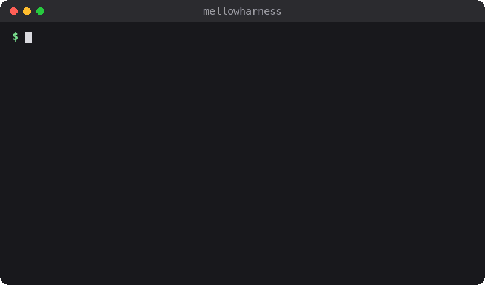
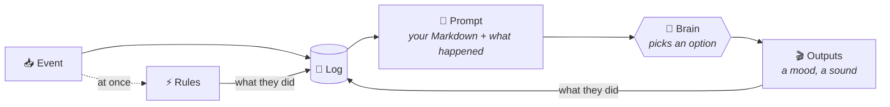

<p align="center">
  
</p>

<h1 align="center">🧠 MellowHarness</h1>

<p align="center">
  <b>Give anything a personality with Markdown and multiple choice.</b>
</p>

<p align="center">
  
  
  
  
</p>

Your CI lamp should sigh at the third red build in a row. Your menu-bar
buddy should perk up when you come back from lunch. You want character,
not a chatbot that writes essays.

MellowHarness is a small Swift library for that. It's the fast,
gut-feel "System 1" from *Thinking, Fast and Slow*: no essays, just a
quick pick from options you wrote.

- 📒 **Remembers everything** in one log you can read, and keeps no other state.
- ⚡ **Reacts at once** with your own rules, before the brain even hears about it.
- 🎛️ **Asks only multiple choice**: how do I feel now? what do I play?
- 📝 **Takes its personality from Markdown**, and never says anything you didn't write.
- 🧪 **Tests without a brain**: a scripted stand-in answers, and Jev or anything else plugs in for real.

## How it works

Things happen to your app. MellowHarness writes each one down as a
line of plain English. When one is worth a thought, it shows a brain
what's happened lately and asks a few multiple-choice questions. Your
code does whatever the answers say.



It comes down to three steps, and you supply the pieces for each.

**1. Something happens.**

- An **event** is one thing that happened: a `source` (`ci`), a `kind`
  (`build_failed`) and some `data` (`branch=main`).
- The **log** keeps every event, on disk. It's the only state: everything
  else is worked out from it.
- An **input** turns one kind of event into a line of English ("The build
  on main failed again, 2 in a row."). With a `wake`, that kind wakes the
  brain.
- A **rule** is your own code, run at once on an event, before the brain
  hears about it: flash the lamp red.

**2. The brain thinks.**

- The **prompt** is your Markdown, then HISTORY (the last 10 minutes of
  lines) and NOW (this event's line).
- The **brain** reads it and picks one option per question:
  [Jev](https://docs.typesafe.ai/api), or `ScriptedBrain` for tests.

**3. Your app acts.**

- An **output** asks the brain its own questions ("How does Light feel?")
  and does what the answers say.
- A **`Choice`** is the one ready-made output: a named value the brain can
  change, like a mood.

Whatever a rule or an output does goes back into the log, so the next
prompt shows it.

- **The brain is never in the way.** Rules handle what's urgent first.
  A call that's late (over 1.5 s) or fails is dropped, and nothing runs.
- **It can only pick.** Every answer is one of the options you wrote, so
  it can't say anything you didn't.

## One event, start to finish

A desk lamp, Light, watches CI. The build on `main` has just failed for
the second time in a row.

**1. The event arrives**, from your code, a socket, or a shell, and goes
into the log:

```json
{
  "seq": 5,
  "at": 1791351803042,
  "source": "ci",
  "kind": "build_failed",
  "data": {"branch": "main", "run": 813}
}
```

**2. A rule reacts at once.** It flashes the lamp red and records that
it did, before the brain is asked anything.

**3. The input writes its line**, looking back through the log to count
the streak:

```
The build on main failed again, 2 in a row.
```

**4. The brain gets the prompt**: your Markdown, then HISTORY and NOW.
Here it is, with only the harness's short how-to-read note left out:

```
GUIDE
You are Light, a desk lamp that watches CI builds. You feel worried.

HISTORY (oldest first; indented lines add to the line above)
just now: The build on main failed.
  Light flashed red on its own.
  tone changed: calm → worried.

NOW (21:48, Wednesday)
The build on main failed again, 2 in a row.
Light flashed red on its own.
```

**5. It answers the question** "After NOW, how does Light feel?" by
picking one of the options you wrote: `worried`.

**6. The output acts on it**, and what it did goes back into the log for
the next prompt to show. Light is already worried, so nothing changes
this time. On the first failure, the same answer changed its tone and
logged:

```json
{
  "seq": 4,
  "at": 1791351801526,
  "source": "self",
  "kind": "did",
  "data": {
    "for": 1,
    "by": "brain",
    "action": "tone",
    "from": "calm",
    "to": "worried",
    "message": "tone changed: calm → worried.",
    "ok": true,
    "latency_ms": 0
  }
}
```

That `message` is the line you can see under HISTORY in step 4.

## Brains

The brain is whatever answers the questions. Two come with the package,
and anything else can plug in.

- **[Jev](https://docs.typesafe.ai/api)** is TypeSafe's small
  multiple-choice model. It's a hosted API: you need a key from TypeSafe,
  and calls may cost money, as their pricing says. With Jev, the whole
  prompt is sent to TypeSafe: your Markdown, and the HISTORY and NOW lines.
- **`ScriptedBrain`** needs no key and no network. It answers from a
  script, and the quick start below uses it.
- **Your own**: any type that implements `Brain`, a single method, can be
  the brain, such as a local model or another provider.
  [ARCHITECTURE.md](ARCHITECTURE.md#your-own-brain) has the contract.

## Get started

You need macOS 13 or later and Swift 6.2 (Xcode 26, or its Command Line Tools:
`xcode-select --install`).

1. **Build it.**

   ```sh
   git clone https://github.com/Mellow-Machines-Lab/MellowHarness.git && cd MellowHarness
   swift build
   ```

2. **Start Beacon**, the worked example from the GIF. It watches CI, with
   a scripted brain answering:

   ```sh
   .build/debug/beacon listen --socket /tmp/bcn.sock &
   ```

3. **Break the build**, twice, then fix it, and watch Beacon cheer:

   ```sh
   .build/debug/mellowharness-emit --socket /tmp/bcn.sock ci build_failed branch=main
   .build/debug/mellowharness-emit --socket /tmp/bcn.sock ci build_failed branch=main
   .build/debug/mellowharness-emit --socket /tmp/bcn.sock ci build_passed branch=main
   ```

## Usage

### Send an event

`mellowharness-emit` sends one event to a harness, from a shell or a
CI script. `swift build` puts it in `.build/debug/`:

```sh
.build/debug/mellowharness-emit --socket /tmp/bcn.sock ci build_failed branch=main run=812
```

| Part | Here | What it is |
| --- | --- | --- |
| `--socket` | `/tmp/bcn.sock` | Where the harness listens: the path your app gave its `EventServer`, or Beacon's `--socket` |
| source | `ci` | Who it's from. Any word |
| kind | `build_failed` | What happened. Any word |
| `key=value` | `branch=main run=812` | Anything else, as many as you like. They go in the event's `data` |

The harness receives it as this event. Plain whole numbers, `true` and
`false` keep their type, and the rest are strings:

```json
{
  "source": "ci",
  "kind": "build_failed",
  "data": {"branch": "main", "run": 812}
}
```

### Run Beacon

`beacon listen` runs the worked example live, with a scripted brain
answering. Give it any socket path you like, and send events to the
same one. It's in `.build/debug/` too, or `swift run` builds and starts it:

```sh
swift run beacon listen --socket /tmp/bcn.sock
```

It prints each event's line, what the rules did, and what the brain
picked. Two failures and a pass look like this:

```
▸ 1 build_failed: The build on main failed.
  ✓ flash: Beacon flashed red on its own.
  pass scripted: play none · tone calm
▸ 4 build_failed: The build on main failed again, 2 in a row.
  ✓ flash: Beacon flashed red on its own.
  pass scripted: play none · tone calm
▸ 7 build_passed: The build on main passed after 2 failures.
  ✓ flash: Beacon flashed green on its own.
  … play: Beacon cheered.
  pass scripted: play cheer · tone calm
```

Run `.build/debug/beacon` on its own instead to play the example's script on a
virtual clock, printing every event and every prompt the brain is sent.

### From your own app

In Swift, add this package to your `Package.swift` and use its
`MellowHarness` library:

```swift
.package(url: "https://github.com/Mellow-Machines-Lab/MellowHarness.git", from: "1.0.0"),
// and in a target's dependencies:
.product(name: "MellowHarness", package: "MellowHarness"),
```

[ARCHITECTURE.md](ARCHITECTURE.md) builds Light in one page.
[Examples/Beacon/](Examples/Beacon/Beacon.swift) is the fuller version.

## Learn more

**[ARCHITECTURE.md](ARCHITECTURE.md)** has how it works in more depth,
the Light example in full, and the exact prompt the brain sees.
[CONTRIBUTING.md](CONTRIBUTING.md) says how to send a change, and
[SECURITY.md](SECURITY.md) how to report a security problem.

MIT-licensed ([LICENSE](LICENSE)).
